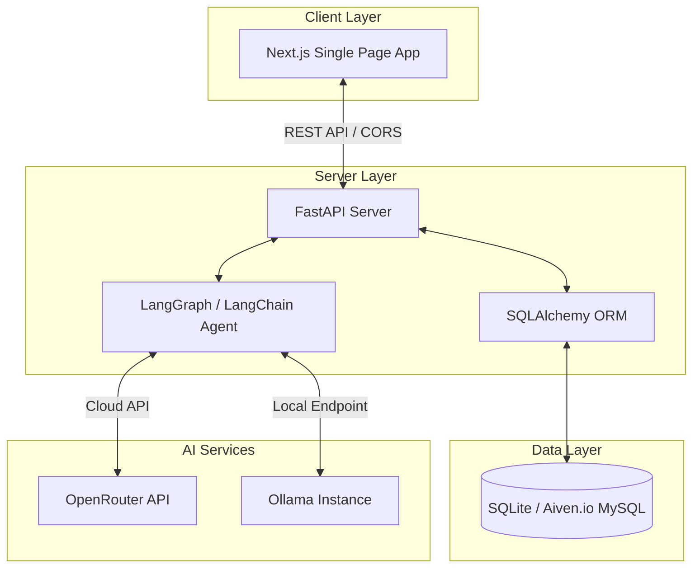

# 💼 JobAnalyser: AI Job Application Assistant

JobAnalyser (AI Job Application Assistant) is a production-ready, full-stack application designed to automate, customize, and optimize job applications. It leverages a state-of-the-art **LangGraph** self-improvement agent loop, a modern **Next.js** frontend, a **FastAPI** backend, and a flexible database layer supporting both local **SQLite** and cloud-hosted **MySQL** (e.g., Aiven.io).

With JobAnalyser, job seekers can tailor resumes, generate high-converting cover letters, compose follow-up emails, test ATS matching scores, and track their applications over time.

---

## 🏗️ System Architecture

JobAnalyser is built using a decoupled, service-oriented architecture:



---

## ✨ Features

* **🤖 LangGraph Self-Improvement Loop**: The agent generates an initial cover letter or resume draft, analyzes it against the job description for gaps, critiques it, and refines it iteratively to ensure the highest possible relevance.
* **💬 Interactive Workspace Chat**: After the initial optimization, users can chat directly with the agent to request revision tweaks (e.g., *"Highlight my SQL database scaling experience"* or *"Make the tone more conversational"*).
* **📊 ATS Scoring & Match Metrics**: Computes matching scores, highlights missing skills, identifies keyword mismatches, and recommends specific improvements for your resume.
* **📁 Master Profile Manager**: Upload and maintain your master resume, experience, background summary, and skills list in one central location.
* **📈 Job Application Tracker & Dashboard**: Track and manage applications throughout their lifecycle (Applied, Interviewing, Offered, Rejected) with real-time visual statistics.
* **🔄 Flexible LLM Provider Switching**: Supports switching between cloud models (via **OpenRouter**, e.g., Llama 3.3 70B) and offline local models (via **Ollama**, e.g., Llama 3.2) with a single `.env` setting.
* **🗄️ Multi-Database Support**: Uses SQLAlchemy to seamlessly transition between local **SQLite** development files and scalable cloud databases (**Aiven.io MySQL**).

---

## 📂 Project Structure

```
.
├── backend/                  # FastAPI Web Backend & AI Agent
│   ├── app/
│   │   ├── api/v1/endpoints/ # API Routers (auth, admin, profile, analyzer, etc.)
│   │   ├── core/             # Database connection & main configurations
│   │   ├── models/           # SQLAlchemy DB Models
│   │   ├── repositories/     # Data Access Layer
│   │   ├── schemas/          # Pydantic Schemas
│   │   ├── services/         # Business logic and LangGraph agent execution
│   │   └── main.py           # FastAPI entry point & automatic DB migrations
│   ├── config.py             # LLM provider factory config
│   ├── requirements.txt      # Python dependencies (LangChain, FastAPI, PyMySQL, etc.)
│   └── .env.example          # Sample environment variables for backend
│
├── frontend/                 # Next.js Single Page App Frontend
│   ├── src/
│   │   ├── app/              # Next.js App Router & Pages (dashboard, workspace, profile, login)
│   │   └── components/       # Reusable UI component libraries
│   ├── package.json          # Node dependencies (Next.js 16, React 19, Tailwind)
│   └── next.config.ts        # Next.js asset and path routing configurations
│
├── start.sh                  # One-click script to run backend & frontend locally
└── README.md                 # Project documentation
```

---

## 🚀 Getting Started

### Prerequisites

* **Python** (version 3.10 or higher)
* **Node.js** (version 20 or higher) & **npm**
* *(Optional)* **Ollama** (if running models locally)

### 1. Clone & Set Up the Backend

1. Navigate to the `backend` directory:
   ```bash
   cd backend
   ```

2. Create a virtual environment and install dependencies:
   ```bash
   python3 -m venv .venv
   source .venv/bin/activate
   pip install -r requirements.txt
   ```

3. Configure your environment variables:
   ```bash
   cp .env.example .env
   ```
   Open the `.env` file and adjust the keys as needed (see [Environment Configuration](#-environment-configuration) below).

### 2. Set Up the Frontend

1. Navigate to the `frontend` directory:
   ```bash
   cd ../frontend
   ```

2. Install the frontend dependencies:
   ```bash
   npm install
   ```

### 3. Run the Application

Return to the project root directory and run the one-click startup script:

```bash
chmod +x start.sh
./start.sh
```

This script spins up:
* The **FastAPI backend** on [http://localhost:8000](http://localhost:8000)
* The **Next.js frontend** on [http://localhost:3000](http://localhost:3000)

Open your browser and navigate to [http://localhost:3000](http://localhost:3000) to access the application workspace.

---

## ⚙️ Environment Configuration

Configure these values in your `backend/.env` file:

### LLM Configurations
| Key | Default | Description |
|---|---|---|
| `PROVIDER` | `openrouter` | Set to `openrouter` (cloud) or `ollama` (local). |
| `OPENROUTER_API_KEY` | - | Your API key from [OpenRouter](https://openrouter.ai/). |
| `OPENROUTER_MODEL` | `meta-llama/llama-3.3-70b-instruct:free` | Primary cloud model to use. |
| `OLLAMA_BASE_URL` | `http://localhost:11434` | Your local Ollama endpoint. |
| `OLLAMA_MODEL` | `llama3.2` | Local model to invoke (ensure you `ollama pull <model>`). |
| `MAX_ITERATIONS` | `1` | Number of critique/self-improvement loops the agent performs. |

### Database & Helpers
| Key | Default | Description |
|---|---|---|
| `DATABASE_URL` | `sqlite:///agent_memory.db` | Connection string. For MySQL cloud deployment, use: `mysql+pymysql://<user>:<password>@<host>:<port>/<dbname>` |
| `JINA_API_KEY` | - | *(Optional)* Key to parse job postings from raw web URLs. |

---

## 🚢 Deployment Guide

### Frontend Deployment (GitHub Pages)
The frontend contains a GitHub Actions workflow configured in [deploy.yml](file:///.github/workflows/deploy.yml) that builds and exports static assets to GitHub Pages on every push to `main`. 
* Make sure `NEXT_PUBLIC_API_URL` is set to your deployed backend URL in your repository's GitHub Actions Secrets.

### Backend Deployment (Render)
1. Deploy the `backend` folder as a **Web Service** on Render (Python environment).
2. Set the start command to:
   ```bash
   python -m uvicorn app.main:app --host 0.0.0.0 --port $PORT
   ```
3. Set your environment variables (like `DATABASE_URL`, `OPENROUTER_API_KEY`, etc.) in the Render dashboard.

### Database Deployment (Aiven.io MySQL)
1. Set up a free MySQL database on [Aiven.io](https://aiven.io/).
2. Fetch the URI connection string from your Aiven project dashboard.
3. Configure the `DATABASE_URL` in your deployed backend environment variables. The backend's PyMySQL connector automatically negotiates SSL encryption out-of-the-box.
