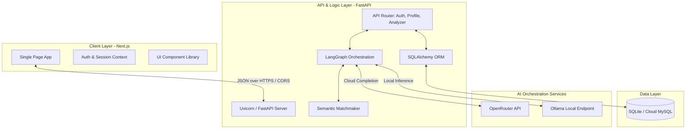

# 💼 JobAnalyser: Comprehensive System Documentation

Welcome to the official, professional documentation for **JobAnalyser (AI Job Application Assistant)**. This document provides an in-depth breakdown of the application's architecture, core capabilities, system design, data schema, agent topology, and deployment operations.

---

## 1. Executive Summary

**JobAnalyser** is a production-ready, full-stack application designed to automate, customize, and optimize job applications for job seekers. Traditional application processes involve manual modifications to resumes and cover letters, which is both time-consuming and prone to missing key keywords that Applicant Tracking Systems (ATS) evaluate.

JobAnalyser solves this by combining a modern, single-page client interface with an AI-driven background agent. By storing a user's **Master Profile** (comprising all their work experience, projects, education, and skills), the system semantically analyzes any target job description and automatically generates highly targeted resumes, cover letters, and follow-up emails. The core AI execution relies on an iterative **self-improvement agent loop** powered by **LangGraph**, ensuring that the resulting application materials are optimized against the job requirements before being presented to the user.

---

## 2. System Architecture

JobAnalyser is built on a decoupled, service-oriented architecture designed for scalability, ease of development, and flexibility in deployment.



### Architectural Tiers:
1. **Client Layer (Frontend)**: A responsive single-page application built on **Next.js** using **React 19** and **Tailwind CSS**. It communicates asynchronously with the backend via REST endpoints.
2. **Server Layer (Backend)**: A high-performance **FastAPI** web server running on **Uvicorn**. It exposes endpoints for authentication, profile configuration, dashboard metrics, and interactive agent communication.
3. **Agent Layer**: Powered by **LangGraph** and **LangChain**, this layer implements a StateGraph executor that controls draft generation, quality critiques, and revision cycles.
4. **Data Layer**: Powered by **SQLAlchemy ORM**, supporting local development database files (**SQLite**) and production enterprise relational databases (e.g., **Aiven.io MySQL**) with automated schema migrations.
5. **Inference Layer**: Abstracted LLM factory allowing toggling between cloud APIs (via **OpenRouter**, e.g., `Llama-3.3-70B`) and fully offline local models (via **Ollama**, e.g., `Llama-3.2`).

---

## 3. Core Capabilities & Product Features

* **🤖 LangGraph Self-Improvement Loop**: Leverages a multi-node agent loop. When generating a cover letter, the agent writes a draft, critiques it against the target job description to find missing skills, refines the draft to address those critiques, and loops until the target quality or maximum iterations are met.
* **💬 Interactive Workspace Chat**: Users are not limited to static generations. The workspace provides an interactive chat interface where users can chat directly with the LangGraph agent to make manual adjustments (e.g., *"Make it sound more professional"* or *"Add my experience with GCP"*).
* **📊 ATS Scoring & Match Metrics**: The system analyzes the resume text against the target job description, identifying matched/missing keywords, and calculates an overall ATS Match Score (0–100%) to help candidates maximize their response rates.
* **📁 Master Profile Manager**: Stores a comprehensive portfolio of the candidate's career. The database holds structured tables of experiences, projects, skills, and academic credentials, removing the need for users to upload files on every single run.
* **📈 Job Application Tracker**: A clean dashboard tracking the status of each job application (Applied, Interviewing, Offered, Rejected) with aggregated progress charts.
* **🔄 Provider Abstraction**: A single configuration setting shifts the entire system from cloud-based AI generation to 100% private, local inference.

---

## 4. LangGraph Agent Workflow & State Machine

The core intelligence of JobAnalyser resides in its structured state machine. Instead of a single linear LLM call, it uses **LangGraph** to model a looping workflow:

### Graph Topology
```
  START
    │
    ▼
  route_entry ──────► generator ──► analyzer ──┐
                │                              │ (loop if iterations < max)
                │                              ▼
                └────► reviser            analyzer ──► END
                        │
                        ▼
                       END
```

### Graph Nodes & Transition Logic:
1. **`route_entry` (Conditional Router)**:
   - Checks if a current draft and an `is_revision` flag exist in the state.
   - If starting fresh, routes to the `generator` node.
   - If the user is submitting a revision message in the chat workspace, routes to the `reviser` node.
2. **`generator` (Drafting Node)**:
   - Compiles the initial cover letter or resume using the candidate's matched profile details and the target job description.
   - Saves the first draft in the state and increments the iteration count.
3. **`analyzer` (Self-Critique & Enhancement Node)**:
   - Inspects the generated draft against the job requirements.
   - Identifies structural and content gaps, then executes a targeted rewrite.
   - Appends audit notes to the critique history.
4. **`should_continue` (Conditional Router)**:
   - Compares current `iterations` against `max_iterations`.
   - If more passes are permitted, routes back to `analyzer` for a self-critique loop.
   - Otherwise, completes the graph and routes to `END`.
5. **`reviser` (Manual Chat Revision Node)**:
   - Bypasses the automatic critique loop.
   - Takes the user's specific instruction from the chat and applies it directly to the existing draft, yielding an updated version instantly.

---

## 5. Core Data Models

Below is the database schema mapping implemented via SQLAlchemy in the backend:

### 5.1 User Management
* **`User`**: Core user record storing name, unique email, hashed password, administrative flags, and an optional text field for long-term user memories.
* **`UserPreference`**: Key-value JSON storage for saving user settings (e.g., favorite templates, preferred tone, default LLM settings).
* **`AuditLog`**: Event tracking database for auditing security operations (e.g., login times, document exports).

### 5.2 Master Profile
* **`MasterExperience`**: Career history items. Contains role title, company name, start/end dates, current status, description text, and serialized arrays of specific bullet points and technologies.
* **`MasterProject`**: Independent projects, including name, description, URLs, highlights, and technologies.
* **`MasterSkill`**: Structured skill categories (e.g., Languages, Frameworks) with proficiency ratings (1-5).
* **`MasterEducation`**: Academic credentials storing institution, degree, field of study, graduation year, GPA, and honors.

### 5.3 Workspaces & Analytics
* **`JobApplication`**: An entry representing a specific job the user applied to. Tracks application status, the final calculated ATS score, job title, company, and resume version number.
* **`SessionStore`**: Persists the state of the active wizard workspace. Stores raw and analyzed job/resume inputs, ATS matching calculations, LLM suggestions, generated artifacts (cover letter, email body, optimized resume), and the serialized JSON chat history.
* **`ResumeVersion`**: Version histories of optimized resumes, allowing candidates to revert to previous versions or review historical alterations.

---

## 6. Execution Data Flow

```
[User Input] (Upload Master Resume / Input Job Description URL)
      │
      ▼
[Document Parsing] (.pdf, .docx, or Jina-powered URL Scrape)
      │
      ▼
[Job Analysis] (LLM extracts Required Skills, Keywords, Experience bounds)
      │
      ▼
[Semantic Matchmaker] (LLM highlights relevant experiences from Master Profile)
      │
      ▼
[LangGraph Agent Loop] (Initial drafting -> Critique -> Enhancements -> Loop)
      │
      ▼
[Refinement Workspace] (User chats with Agent to tweak and revise text)
      │
      ▼
[Export & Apply] (Download as HTML, Word document, or Copy Email copy)
```

---

## 7. Configuration & Installation QuickStart

### Local Setup
1. **Install Backend Dependencies**:
   ```bash
   cd backend
   python3 -m venv .venv
   source .venv/bin/activate
   pip install -r requirements.txt
   ```
2. **Configure Environment Variables**:
   Copy `backend/.env.example` to `backend/.env` and specify your keys. To run locally and privately:
   ```ini
   PROVIDER=ollama
   OLLAMA_MODEL=llama3.2
   DATABASE_URL=sqlite:///agent_memory.db
   ```
3. **Set Up Frontend**:
   ```bash
   cd ../frontend
   npm install
   ```
4. **Boot Up Services**:
   Run the following in the project root:
   ```bash
   ./start.sh
   ```
   Access the frontend dashboard at [http://localhost:3000](http://localhost:3000) and the API explorer at [http://localhost:8000/docs](http://localhost:8000/docs).

---

## 8. Deployment Overview

* **Database (Aiven.io MySQL)**: Seamless cloud deployment using a connection URI like `mysql+pymysql://<user>:<password>@<host>:<port>/<dbname>`. Connection security is handled out-of-the-box via SQLAlchemy SSL negotiation.
* **Backend API (Render)**: Deploy as a Python Web Service with start command `python -m uvicorn app.main:app --host 0.0.0.0 --port $PORT`.
* **Frontend SPA (GitHub Pages)**: Static export (`next build` / `next export`) deployed via GitHub Actions using the `.github/workflows/deploy.yml` configurations.
